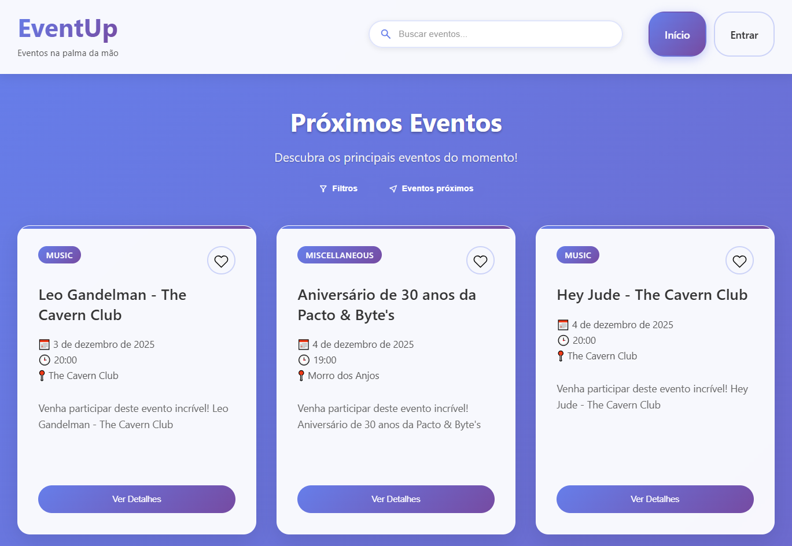

# 🎉 EventUp - Aplicativo de Eventos



## Descrição
O **EventUp** é um aplicativo desenvolvido com **React** e **Vite**, projetado para gerenciar eventos de forma intuitiva. Ele permite visualizar, favoritar e detalhar eventos usando um menu de navegação entre páginas e conta com gestos dedicados no mobile para alternar telas, mantendo o comportamento de um app nativo. A mesma base alimenta a versão mobile construída em **React Native/Expo**, garantindo continuidade total entre web e aplicativo nativo.

---

## 🚀 Tecnologias Utilizadas
- **React**: Biblioteca JavaScript para construção de interfaces de usuário.
- **Vite**: Ferramenta de build moderna e rápida para desenvolvimento front-end.
- **CSS**: Estilização da interface.
- **Ticketmaster API** — Fonte de dados em tempo real sobre eventos públicos (shows, esportes, teatro e muito mais).
- **React Testing Library + Vitest** — Testes funcionais de componentes individuais, validando renderização completa de dados e resultados de ações.
- **React Native / Expo** — Versão mobile nativa com os mesmos recursos de listagem, detalhes, favoritos e gestos implementados no web.

---

## 📦 Instalação e Execução

1. Clone o repositório e entre na pasta:
    
       git clone https://github.com/Guilherme-Borges-Silva/eventup-guilherme.git
       cd eventup-guilherme/projeto-eventup

2. Instale as dependências:
    
       npm install

3. Inicie o servidor de desenvolvimento:
    
       npm run dev

4. Execute os testes dos componentes (opcional):

       npm run test

   Os testes validam componentes individuais (EventCard, EventDetails, Favorites, Header), verificando:
   - Renderização completa de todos os dados
   - Resultados de ações (ex: favoritar, compartilhar, buscar)
   - Mudanças de estado após interações

---

## Variáveis de ambiente

O projeto já inclui um arquivo `.env` com a chave da Ticketmaster API. Caso ocorra algum erro relacionado à API (por exemplo, falha de autenticação), crie ou edite o arquivo `.env` na pasta `projeto-eventup` com o seguinte conteúdo:

VITE_TICKETMASTER_API_KEY=sua_chave_api_ticketmaster_aqui

Observação: crie o arquivo `.env` dentro da pasta `projeto-eventup/` (caminho relativo ao repositório). Por exemplo, um arquivo `projeto-eventup/.env` pode conter:

```
VITE_TICKETMASTER_API_KEY=sua_chave_api_ticketmaster_aqui
```

No Windows PowerShell você pode criar rapidamente o arquivo com:

```powershell
cd projeto-eventup
echo VITE_TICKETMASTER_API_KEY=sua_chave_api_ticketmaster_aqui > .env
```


---

## 📋 Recursos Implementados

- ✔️ Busca de eventos por nome  
- ✔️ Filtro por categoria  
- ✔️ Filtro por cidade/localização (recurso do celular)
- ✔️ Favoritar e desfavoritar  
- ✔️ Tela de favoritos  
- ✔️ Compartilhamento de eventos  
- ✔️ Página de detalhes completa  
- ✔️ Navegação entre páginas  
- ✔️ Responsividade  
- ✔️ Sistema de autenticação
- ✔️ Versão mobile com gestos (swipe para navegar)  
- ✔️ Testes funcionais de componentes (renderização completa e resultados de ações)

---

## 🖥️ Requisitos
- **Node.js 16+** (ou superior usado no desenvolvimento)
