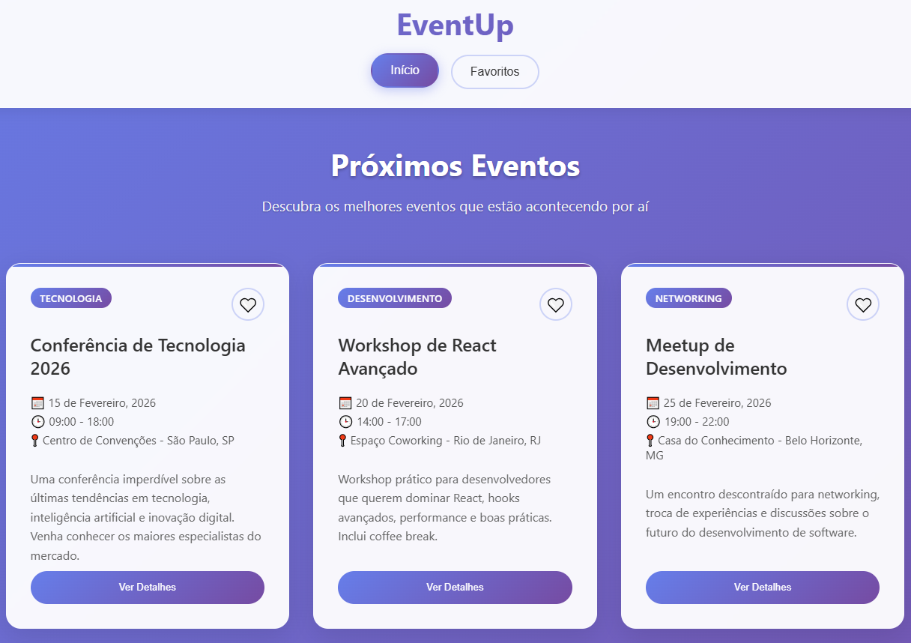

# 🎉 EventUp - Aplicativo de Eventos

## Descrição
O **EventUp** é um aplicativo desenvolvido com **React** e **Vite**, projetado para gerenciar eventos de forma intuitiva. Ele permite que os usuários visualizem, adicionem e excluam eventos, facilitando o planejamento e organização de atividades.

---

## 🚀 Tecnologias Utilizadas
- **React**: Biblioteca JavaScript para construção de interfaces de usuário.
- **Vite**: Ferramenta de build moderna e rápida para desenvolvimento front-end.
- **CSS**: Estilização da interface.
- **Ticketmaster API** — Fonte de dados em tempo real sobre eventos públicos (shows, esportes, teatro e muito mais).  

---

## 📦 Instalação e Execução

1. Clone o repositório e entre na pasta:
    
       git clone https://github.com/Guilherme-Borges-Silva/eventup-guilherme.git
       cd eventup-guilherme/projeto-eventup

2. Instale as dependências:
    
       npm install

3. Inicie o servidor de desenvolvimento:
    
       npm run dev

---

## Variáveis de ambiente

O projeto já inclui um arquivo `.env` com a chave da Ticketmaster API. Caso ocorra algum erro relacionado à API (por exemplo, falha de autenticação), crie ou edite o arquivo `.env` na pasta `projeto-eventup` com o seguinte conteúdo:

VITE_TICKETMASTER_KEY=sua_chave_api_ticketmaster_aqui

## Requisitos

- Node.js 16+ (ou versão usada no desenvolvimento)